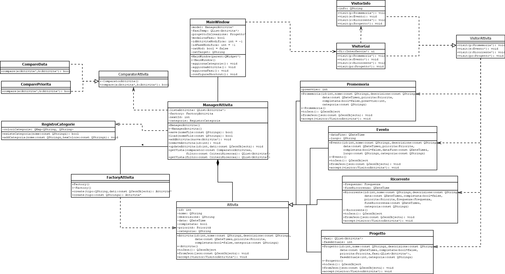

# Introduzione

Il presente progetto riguarda lo sviluppo di un'applicazione To-Do List
dedicata alla gestione e al tracciamento di impegni, scadenze e attività
quotidiane. L'obiettivo del software è ottimizzare l'organizzazione
personale dell'utente attraverso una gestione comoda dei task, i quali
sono strutturati in diverse tipologie, ciascuna dotata di
caratteristiche, proprietà e comportamenti specifici.

L'interfaccia grafica trae ispirazione dal layout e dall'esperienza
d'uso del software \"Microsoft To Do\", ridefinito per offrire
un'interfaccia intuitiva e focalizzata sull'usabilità.

Dal punto di vista progettuale, il nucleo dell'applicazione sfrutta
estensivamente il meccanismo del polimorfismo in C++. Inoltre, l'intera
architettura software è stata progettata seguendo diversi Design Pattern
fondamentali, una scelta che garantisce la modularità, la manutenibilità
e la scalabilità del codice a fronte di future estensioni del sistema.

# Descrizione del Modello Logico

L'architettura del software si basa sul pattern architetturale
Model-View, una scelta progettuale finalizzata a garantire una netta
separazione tra la logica funzionale (Model) e l'interfaccia utente
(View). Questa separazione delle competenze favorisce un solido
incapsulamento dei dati e una gestione sicura dei dati, aumento
contemporaneamente la mantenibilità e la scalabilità del sistema.

## Gerarchia delle Attività

Il nucleo dell'applciazione è strutturato attorno alla classe base
`Attività`, la quale centralizza la gestione degli attributi comuni a
qualsiasi tipologia di task: un identificativo, una data di scadenza,
una descrizione opzionale e la categoria di appartenenza.

Sfruttando il meccanismo dell'ereditarietà, la classe base è stata
specializzata in quattro sottoclassi distinte, ciascuna modellata per
rispondere a specifiche esigenze funzionali:

- **Promemoria:** Estende l'attività introducendo una soglia di
  preavviso temporale configurabile dall'utente. Al raggiungimento di
  tale finestra temporale, la View evidenzia visivamente la scadenza
  imminente.

- **Evento:** Rappresenta un impegno strutturato all'interno di un
  preciso intervallo temporale. In aggiunta alle proprietà ereditate,
  include un attributo relativo alla data e ora di conclusione e,
  opzionalmente, una stringa dedicata al luogo dell'impegno.

- **Ricorrente:** Rappresenta task soggetti a ripetizione periodica con
  frequenza personalizzabile (giornaliera, settimanale o mensile). La
  logica prevede che, all'atto del completamento dell'occorrenza
  corrente, il sistema calcoli e pianifichi automaticamente il task
  successivo fino al raggiungimento della data di fine ricorrenza
  prestabilita dall'utente.

- **Progetto:** Iil Progetto costituisce un'attività complessa concepita
  come contenitore di altri task (siano essi Promemoria, Eventi o
  Ricorrenze). Questa classe consente di organizzare flussi di lavoro
  articolati, monitorando lo stato di avanzamento complessivo e la
  sequenza dei sotto-compiti.

## Separazione delle Responsabilità: `ManagerAttivita` e `RegistroCategorie`

Al fine di garantire una rigorosa aderenza al **Principio di Singola
Responsabilità**, la logica di gestione dell'applicazione è stata
strutturata separando nettamente la manipolazione dei task dalla
gestione delle categorie del sistema. Sono stati quindi definiti due
classi specializzate:

- **`ManagerAttivita`:** Mantiene la responsabilità esclusiva
  sull'insieme delle attività, coordinando le operazioni fondamentali di
  inserimento, aggiornamento e rimozione delle istanze di `Attività`.

- **`RegistroCategorie`:** Presiede unicamente alla gestione del
  catalogo delle categorie disponibili e alla memorizzazione
  dell'associazione a un codice colore identificativo.

La collaborazione tra questi moduli è stata formalizzata attraverso una
relazione **Has-A**, in cui il `ManagerAttivita` detiene un riferimento
verso il `RegistroCategorie`.

Questa scelta progettuale offre un duplice vantaggio: da un lato
permette al `ManagerAttivita` di validare la coerenza delle categorie
durante la manipolazione dei dati, dall'altro consente al
`RegistroCategorie` di mantenere separata la gestione delle categorie,
senza andare a creare un unica classe che gestisce completamente i dati.

## Design Pattern Adottati

Al fine di garantire la modularità, l'estendibilità e un elevato grado
di manutenibilità del codice, l'architettura software integra in modo
sinergico diversi design pattern, sia creazionali che comportamentali.
Di seguito vengono analizzate le soluzioni implementate e le relative
motivazioni progettuali:

- **Factory Method:** Viene utilizzato per centralizzare e isolare la
  logica di istanziazione degli oggetti appartenenti alla gerarchia di
  `Attività`. Invece di accoppiare direttamente l'interfaccia grafica
  alle classi concrete, la creazione viene delegata a un metodo
  centralizzato (`create`). Questo approccio non solo standardizza il
  ciclo di vita degli oggetti garantendone la coerenza, ma semplifica
  l'estendibilità del sistema: l'introduzione futura di una nuova
  tipologia di task richiederà unicamente l'aggiunta di un nuovo ramo di
  instanziazione nella Factory, lasciando inalterato il resto del codice
  applicativo.

- **Observer Pattern:** Il pattern viene applicato sfruttando il
  meccanismo nativo di *Signals and Slots* offerto dal framework Qt.
  Questa soluzione consente di disaccoppiare nettamente il
  `ManagerAttivita` (che agisce come Modello) dalla `MainWindow` (la
  Vista). Qualsiasi mutamento nello stato dei dati (inserimento,
  modifica o cancellazione di un'attività) genera l'emissione di un
  segnale che notifica automaticamente la View, forzando il refresh
  dell'interfaccia grafica e garantendo la sincronizzazione tra Model e
  View in modo robusto.

- **Visitor Pattern:** Adottato per separare rigidamente la struttura
  dei dati (le classi della gerarchia `Attività`) dagli algoritmi
  operativi eseguiti su di essi, nello specifico la visualizzazione
  grafica all'interno delle tabelle della GUI. Attraverso
  l'implementazione del metodo polimorfico `accept` nelle sottoclassi e
  lo sviluppo del componente `VisitorGui`, viene attivato un meccanismo
  di *double dispatch*. Ciò consente di definire la formattazione
  grafica specifica per ciascuna tipologia di attività senza dover
  \"inquinare\" le classi con dipendenze dirette verso le librerie di
  Qt.

- **Strategy Pattern:** Impiegato per definire una famiglia di algoritmi
  di ordinamento intercambiabili dinamicamente a tempo di esecuzione.
  Sfruttando la classe base astratta `ComparatorAttivita` dotata del
  metodo polimorfico `compare`, sono state isolate le diverse logiche di
  ordinamento (per data di scadenza o per livello di priorità). In
  questo modo l'aggiunta di nuovi criteri di classificazione richiederà
  esclusivamente lo sviluppo di una nuova classe derivata di
  `ComparatorAttivita`.

<figure id="fig:uml_diagram" data-latex-placement="htbp">

<em>Nota: Le classi Attivita, VisitorAttivita e ComparatorAttivita
sono classi astratte.</em>

<figcaption>Diagramma UML delle classi.</figcaption>
</figure>

# Persistenza dei Dati

Per garantire la persistenza dello stato dell'applicazione tra sessioni
di esecuzione differenti, è stato adottato il formato standard **JSON
(JavaScript Object Notation)**. Questa scelta è motivata dalla natura
snella, leggibile e facilmente strutturabile del formato, ampiamente
supportato dalle classi native del framework Qt (`QJsonDocument`,
`QJsonObject`, `QJsonArray`).

L'applicazione offre funzionalità complete di importazione ed
esportazione, consentendo il salvataggio o il ripristino dell'elenco
delle attività senza alterare l'integrità di ciascun oggetto. In fase di
importazione, il sistema offre due differenti strategie di gestione
dello stato:

- **Modalità Append (Aggiunta):** Le attività caricate dal file JSON
  vengono aggiunte alla collezione esistente, preservando i task già
  visualizzati nella GUI e generando opportunamente nuovi identificativi
  univoci dove necessario per evitare collisioni.

- **Modalità Overwrite (Sostituzione):** La memoria corrente viene
  interamente resettata, sovrascrivendo completamente lo stato
  dell'applicazione con i soli dati estratti dal file JSON.

Il nucleo della persistenza si basa sul polimorfismo. La classe base
astratta `Attivita` definisce l'interfaccia di persistenza attraverso
due metodi virtuali puri:

- `virtual QJsonObject toJson() const = 0;` (Serializzazione)

- `virtual void fromJson(const QJsonObject& json) = 0;`
  (Deserializzazione)

Ogni classe derivata (`Promemoria`, `Evento`, `Ricorrente`, `Progetto`)
implementa tali metodi in modo specializzato. Ciascuna sottoclasse si
occupa di mappare i propri attributi esclusivi (come i tempi di
preavviso o i vettori di sotto-fasi) all'interno del dizionario JSON,
delegando alla classe base il salvataggio dei campi comuni (ID, nome,
descrizione, data, priorità).

Il controllo dei flussi di Input/Output su file è centralizzato nella
classe `ManagerAttivita` tramite i metodi pubblici `save` e `load`.
Durante il processo di salvataggio, il manager itera in modo polimorfico
sulla collezione di `Attivita`, invocando il metodo `toJson()` di
ciascun oggetto e accumulando i risultati in un array JSON poi
serializzato su disco. Durante il processo di caricamento, il manager
legge il file e delega la ricostruzione degli oggetti alla
`FactoryAttivita`. La Factory esamina il campo `"tipo"` presente nel
JSON per istanziare dinamicamente l'oggetto concreto corretto e invoca
il metodo `fromJson()` per ripristinarne lo stato originario,
restituendo al manager il puntatore polimorfico pronto per l'uso.

# Uso del polimorfismo

Il polimorfismo all'interno dell'applicazione viene sfruttato
principalmente per garantire la **persistenza dei dati** e per
l'implementazione di specifici **design pattern**.

## Persistenza dei dati

I metodi polimorfici `toJson()` e `fromJson()` semplificano le
operazioni di importazione ed esportazione delle attività su file in
formato JSON. Grazie al meccanismo del dynamic binding, è possibile
invocare la medesima funzione su un qualsiasi puntatore alla classe base
`Attivita`.

Ogni sottoclasse concreta (come `Progetto` o `Ricorrente`) ridefinisce
il comportamento di questi metodi per serializzare e deserializzare
correttamente i propri attributi specifici. In questo modo, il
componente gestore (`ManagerAttivita`) può manipolare le collezioni di
dati in modo astratto, senza dover conoscere il tipo specifico
dell'oggetto polimorfico.

## Design Pattern

Il polimorfismo gioca un ruolo centrale nell'architettura dei pattern
adottati:

- **Ordinamento flessibile:** Il metodo polimorfico `compare()` permette
  di incapsulare diverse logiche di confronto tra gli oggetti. Ciò
  consente di ordinare i vettori di attività in base a criteri
  flessibili e dinamici, mantenendo il codice aperto a future
  estensioni.

- **Interfaccia Grafica e Visitor Pattern:** Il polimorfismo viene
  sfruttato per separare nettamente la logica dei dati dalla loro
  rappresentazione visiva nella GUI. Attraverso il meccanismo del
  *double dispatching* implementato tramite i metodi polimorfici
  `accept(Visitor*)` ed i rispettivi metodi `visit()`, il componente
  grafico riesce a recuperare e formattare le informazioni specifiche di
  ogni variante di attività. Questa soluzione architetturale elimina la
  necessità di ricorrere a costosi e complessi cicli di cast a tappeto
  all'interno del codice.

# Funzionalità Avanzate ed Esperienza Utente

Oltre ai requisiti funzionali minimi richiesti in fase di specifica,
l'applicazione integra una serie di estensioni architetturali e di
usabilità volte a ottimizzare la User Experience..

## Ordinamento Dinamico Birezionale

Sfruttando la flessibilità del già citato **Strategy Pattern**, il
sistema non si limita a ordinare le attività secondo criteri statici, ma
permette all'utente di invertire dinamicamente l'ordine di
visualizzazione (*ascendente* e *discendente*) a tempo di esecuzione. Il
meccanismo aggiorna istantaneamente la vista della `QTableWidget` senza
richiedere il ricaricamento distruttivo dei dati dal file di
persistenza, preservando la fluidità dell'interfaccia.

## Ricerca Testuale in tempo reale

È stata implementata una barra di ricerca testuale operante in tempo
reale sul nome delle attività. Questa funzionalità sfrutta il meccanismo
dei segnali di Qt (nello specifico catturando l'evento `textChanged`),
intercettando l'input dell'utente a ogni singolo carattere digitato. Il
sistema esegue un filtraggio sulla collezione applicando un pattern
matching immediato, aggiornando la vista grafica senza bloccare la GUI.

## Scorciatoie da Tastiera

Per massimizzare l'efficienza operativa l'applicazione supporta una
mappatura di scorciatoie da tastiera (*shortcut*), integrate nativamente
tramite la gestione degli eventi di Qt:

- **`Invio`:** Agisce come attivatore di default per la conferma e il
  salvataggio nei form di creazione e modifica, sia per le attività che
  per le categorie, riducendo la necessità di interazione tramite mouse.

- **`Esc`:** Fornisce un'uscita rapida e sicura dai dialoghi di
  inserimento, annullando le modifiche correnti e ripristinando lo stato
  precedente della vista.

- **`CTRL + N`:** Consente il salto contestuale immediato alla schermata
  di creazione di un nuovo task.

- **`CTRL + S`:** Consente di aprire direttamente l'interfaccia di
  sistema per il salvataggio del file di esportazione.
